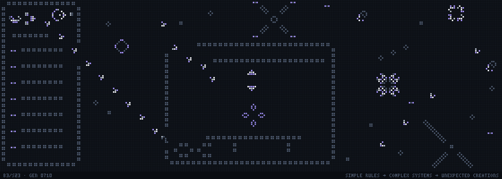

# The banner is running Conway's Game of Life

<p align="center"></p>

Every frame of [`assets/life-banner.gif`](../assets/life-banner.gif) is one generation of
Conway's Game of Life (B3/S23), computed from the frame before it. Nothing is drawn by
hand after generation 0: the rack, the glider stream, the printer, the part on the bed,
the drone and the sky are all live cells that happen to be arranged so the machines keep
working. The loop back to the first frame is also a real Conway step.

## 1. How the simulation works

[`life/engine.py`](../life/engine.py) holds the whole engine: about 20 lines and no
dependencies. A state is a `frozenset` of live `(x, y)` cells on an unbounded plane. No
grid edge, no wrapping.

```python
counts = Counter((x + dx, y + dy) for x, y in live for dx, dy in NEIGHBOUR_OFFSETS)
next   = {cell for cell, n in counts.items() if n == 3 or (n == 2 and cell in live)}
```

- A live cell with fewer than 2 live neighbours dies, and one with more than 3 dies.
- A live cell with 2 or 3 neighbours survives.
- A dead cell with exactly 3 neighbours is born.

The composition is built at generation 0 and run forward. The GIF shows generations
**600 to 1199**, one frame each. By generation 600 the glider stream has crossed the
banner and every colour has settled. Gliders that leave the picture keep flying in the
simulation; they are simply no longer drawn.

The engine does not care where it runs. It could drive an interactive version on
[onecreations.in](https://onecreations.in) unchanged: port the two lines above.

## 2. What is in the picture

| Region | Built from | Stands for |
|---|---|---|
| **Systems**, left | a **Gosper glider gun** inside a rack of dotted **block** rails, with seven **blinker** status LEDs | software that is always running |
| The stream | the gun's **gliders**, one every 30 generations, travelling to the printer | information leaving the system |
| **Printer**, centre | an enclosure, gantry and bed made of **blocks**; the hot end is a **pentadecathlon** (p15); the data port is an **eater 1** that swallows each glider and repairs itself | software becoming physical |
| **The print job** | five **gliders** arriving from beyond the top edge, "from the cloud", and one **seed block** on the bed | a job being manufactured |
| **Flight**, top centre | an X-frame quadcopter: a **pond** body, four **long barge** arms and four **blinker** propellers (a blinker turns a quarter turn every generation) | FPV and electronics |
| **Sky**, right | Orion: **tubs**, **blocks** and a twinkling **blinker**; Betelgeuse, a pulsating variable star, is a **mold** (p4). Under the belt, M42 is a **pulsar** (p3). A **long barge** telescope on a tripod points at it. Top right, **Kok's galaxy** (p8) winds and unwinds like a spiral galaxy, and an **octagon 2** (p5) pulses over the rack | astrophotography |
| **Meteor shower** | **gliders** heading south-west, eight per loop, falling through the sky from beyond the right edge and out through the bottom | motion in the night sky |
| **OneCreations** | an **O** and a **C** made of blocks, the maker's mark on the printer's base | the workshop all of this comes out of |

`python -m life.composition` prints the full pattern map: every part, its pattern, its
period, its coordinates and what it means.

## 3. The print job: a real Life construction

The part on the bed is not a sprite. It is built by **slow-salvo construction**, the same
technique used to build self-constructing machines in Life. Gliders arrive one at a time,
all travelling the same direction, and each reaction settles before the next glider comes.

The printer runs this job twice per loop, starting at generations 600 and 900:

| glider released at gen | lane (relative to the seed) | the seed becomes |
|---|---|---|
| 600 / 900 | +4 | ~35 generations of blooming, then at **gen 635 / 935** a **honey farm** (four beehives, 24 cells) |
| 770 / 1070 | +1 | two beehives |
| 810 / 1110 | +3 | a blinker |
| 838 / 1138 | −1 | a blinker, one cell over |
| 863 / 1163 | −3 | **the original block, in the same place**, ready for the next job |

One glider plus one block, and out comes a symmetric honey farm: *simple rules → complex
systems → unexpected creations*. The four-glider "unbuild" is what lets the loop close.

The recipe was found by [`tools/salvo_search.py`](../tools/salvo_search.py). It runs a
breadth-first search over every clean glider/still-life collision reachable from a block,
keeps reactions that settle into still lifes or blinkers without emitting anything, and
then looks for cycles that come back to the identical block. Depth 5 takes about 3
minutes, and the cheapest cycle it finds is this one. The timings above were checked by
flying the whole salvo in from far away (see the tests), so no glider in flight clips the
honey farm.

## 4. Why the composition looks the way it does

Life destroys almost everything you draw. The scene stays readable because it uses only
structures that are stable, periodic, or controlled:

- **Dotted rails.** Every frame, wall, rail and bed is blocks on a 3-cell lattice. A
  straight run is a still life: the one-cell gap between two blocks sees 2 or 4
  neighbours, never 3. A diagonal step is safe too. An L-corner is not, because the inner
  corner sees exactly 3 neighbours and a cell is born. So every frame has open corners.
- **Two-cell clearance.** Separate objects keep at least two dead cells between them, so
  no dead cell can see both.
- **Glider lanes.** A south-east glider keeps `x − y` constant. Anything within 4 of the
  stream's or the salvo's lanes, along the stretch where they fly, is left out. That is
  why the rack has a port in its right wall and the printer has an open top-left corner:
  it is where the print jobs come in.
- **The gun and eater.** The eater's position was found by search: every offset along
  the lane where gun + eater is exactly period 30 with nothing escaping.
- **Periods.** Every machine's period (1, 2, 3, 4, 5, 8, 15, 30) divides 600.

## 5. Looping

The loop combines both options from the brief. There is no restart and no fade.

- All machinery has a period dividing **600**. The gun and its stream have period 30,
  and all the oscillators together repeat every 120.
- The print job is an exact cycle, block → honey farm → block, run every 300 generations.
  Copies of the salvo sit 75 diagonals apart up their lanes (300 generations of glider
  travel), so each job's gliders are exactly where the previous job's were.
- Meteors work the same way: each meteor has a copy 150 diagonals further up its lane,
  which reaches the screen exactly one loop later.

So the **window at generation 1200 is identical to the window at generation 600**, cell
for cell. It even renders pixel-identically: print jobs run from generation 0 on, so the
seed block's age, and therefore its colour, matches too. The jump from the
last frame back to the first is one more genuine Conway step. The world as a whole is not
periodic, since gliders keep leaving to infinity, but everything visible is.

## 6. Rendering

- 280 × 96 cells, drawn 4 px on a 5 px pitch: **1400 × 480** of grid plus a 20 px
  caption strip, **1400 × 500** in total. Dead cells are faint squares, so the grid is
  always visible.
- Colour is metadata only. Each live cell is drawn in one of five colours according to
  how long it has been alive:

  | age | colour | what shows up in it |
  |---|---|---|
  | 1 | violet | births: gliders' leading edges, blinker tips |
  | 2–3 | white | fast activity: the gun's shuttles, the pulsar |
  | 4–29 | light grey | slower oscillators, repaired eater cells |
  | 30–199 | violet-grey | things made recently, like the printed honey farm and the seed |
  | 200+ | steel | infrastructure that has always been there |

  A cell is drawn if and only if it is alive, as one flat square. Ages are computed from
  states and never fed back.
- The caption is a 3×5 pixel font defined in [`life/pixelfont.py`](../life/pixelfont.py).
  No system fonts are used, so output is identical on every machine.
- GIF encoding: frame 0 is complete. Every later frame keeps only the pixels that
  changed, with the rest transparent (disposal 1), so viewers composite the exact
  picture. 600 frames at 30 ms (about 33 generations a second) is an 18-second loop of
  about **2.9 MB**.

## 7. How correctness is verified

`python -m life.verify` checks the published files against independent code:

1. **Rules.** A second B3/S23 implementation visits every candidate cell, counts its eight
   neighbours one by one and applies the four rules literally. It agrees with the engine
   on every displayed generation: frame N+1 = Conway(frame N).
2. **The GIF itself.** Each frame is decoded from pixels back into cells. Every cell square
   must be one flat colour, either a live colour or the dead colour, and every grid-gap
   pixel must be background. Then a third implementation (numpy array shifts) checks that
   decoded frame N+1 = Conway(decoded frame N) for every cell whose neighbourhood is
   inside the picture, **including last frame → first frame**. That is 15.7 million cell
   updates.
3. **Loop.** The window at 1200 equals the window at 600 and renders pixel-identically.
4. **Print jobs.** Both jobs' gliders, flown in with nothing else around, make a honey
   farm and return to the identical block, twice.
5. **Manifest.** Decoded frames match the per-generation hashes in
   [`assets/life-banner.json`](../assets/life-banner.json).

`pytest` covers the four rules, the known patterns (block, beehive, loaf, boat, tub, pond
and eater are still; blinker, toad, beacon and clock have period 2; pulsar 3; mold 4;
octagon 2 5; Kok's galaxy 8;
pentadecathlon 15; the glider moves (1, 1) every 4 generations; the LWSS moves 2 cells
every 4; the Gosper gun fires one glider per 30 generations), the engine against the
reference on random soups, and every property of the composition above.

Also cross-checked against a completely different engine, the Rust HashLife from my
life-lab project (private for now): run `python -m tools.crosscheck_hashlife --life-lab
<checkout>`. At generation 1200 both engines give the same 1,824 cells.

## 8. Regenerating

```bash
python -m venv .venv && . .venv/bin/activate
pip install -r requirements.txt

python -m life.generate          # writes assets/life-banner.{gif,json} and -preview.png
python -m life.verify            # proves the published GIF is Conway's Life
pytest                           # unit tests for the engine, patterns and composition
python -m life.composition       # prints the pattern map
python -m tools.salvo_search     # re-derives the print-job recipe (≈3 min)
```

Output is deterministic: the same composition and settings give the same states and the
same manifest. CI ([`.github/workflows/banner.yml`](../.github/workflows/banner.yml))
runs the tests, verifies the committed GIF and checks that regenerating reproduces the
committed manifest. It never regenerates the banner on its own.

## 9. Easter eggs

- The rack really does contain a Gosper glider gun, Bill Gosper's 1970 pattern and the
  first known one to grow forever.
- The telescope tube lies on the exact diagonal through M42's centre, so it really is
  pointed at the nebula.
- The caption's generation counter is the true generation number of each frame.
- **OC** on the printer base: two rings of blocks, the second one opened.

## 10. Compromises

- **The printer's top-left corner is open.** The print jobs have to get in somehow, and
  any wall across their lanes would destroy them.
- **The part is abstract.** A honey farm is the best object a single glider can make from
  a block. It reads as a small ornament, not as a recognisable product.
- **Print jobs come from off-screen.** The rack cannot send them: a finite salvo cannot be
  emitted periodically without a much larger gun and gate circuit than fits in 280
  cells. They arrive from above, and the gun's stream carries the "system → printer" link.
- **Shapes are schematic.** Life has no straight solid lines that are stable, so the
  machines are drawn in dotted blocks and diagonal barges.
